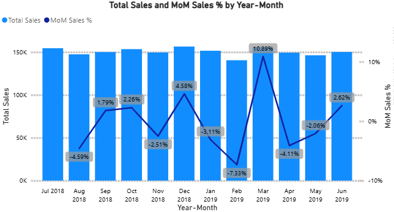
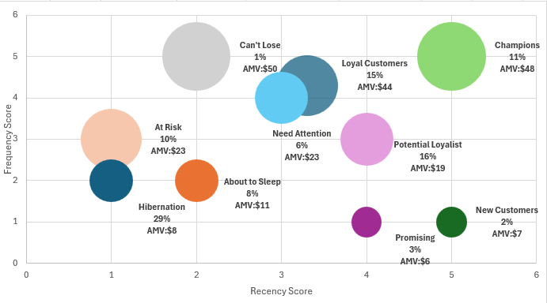
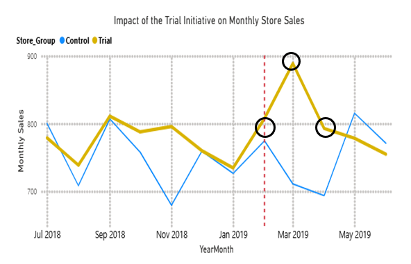

# Quantium-Chips-Retail-Analytics-
This is  retail data analytics project that analyses transaction and customer data, examine sales drivers to gain insights into overall sales performance, analyse customer purchasing behaviour.


### 1. Project Overview 
- This project identifies customer segments through purchase behaviour
- Aims to analyse transaction and customer data of chip stores to identify trends and inconsistencies
- Develop metrics and examine sales drivers to gain insights into overall sales performance
- Create visualisations and prepare findings to formulate a clear recommendation for the client's strategy

### 2. Data Visualisation

### Overall Financial Trend
This chart shows monthly sales performance alongside MoM growth to highlight trends, seasonality, and overall business momentum.



### RFM Customer Distribution
A customer segmentation view mapping frequency and recency across segments to identify high-value customers, prioritise retention opportunities, and flag segments at risk of churn.



### Trial and Control Stores Revenue Distribution
This line chart compares trial and control store sales to evaluate the impact of the initiative and identify measurable sales uplift.



### 3. Data Sources 
The dataset used for this analysis is the "data.csv" file, containing detailed information about:
- date of each transaction
- different store numbers
- distinct loyalty card number for each customer
- different types of products
- number of transactions purchased by a customer on a particular day
- transaction IDs
- sales per transaction
- units sold per transaction

### 4. Tools
- Excel - Data visualisation (bubble chart)
- Jupyter Notebook - Data exploration,  text preprocessing
- Python Google Colab - Data analysis
- SQL - Google Colab Duckdb
- Power BI
- Microsoft PowerPoint

### 5. Technical Highlights 
**Setting up RFM model (sql)**
```sql
# RFM Segmentation (Recency, Frequency, Monetary)
query_rfm = """
WITH customer_rfm AS (
    SELECT
        LYLTY_CARD_NBR,
        MAX(DATE) AS last_purchase,
        COUNT(DISTINCT TXN_ID) AS frequency,
        SUM(TOT_SALES) AS monetary
    FROM df
    GROUP BY LYLTY_CARD_NBR
),
recency_calc AS (
    SELECT
        LYLTY_CARD_NBR,
        date_diff('day', last_purchase, (SELECT MAX(DATE) FROM df)) AS recency,
        frequency,
        monetary
    FROM customer_rfm
)
SELECT
    LYLTY_CARD_NBR,
    recency,
    frequency,
    monetary
FROM recency_calc
ORDER BY monetary DESC
LIMIT 20
"""
df_rfm = duckdb.query(query_rfm).to_df()
df_rfm
```

**Using Pearson Correlation to find control stores for the given trial stores (python)**
```python
#  Correlation function
def calculate_correlation(df, metricCol, storeComparison):
    rows = []
    # months for this trial store (should be complete)
    trial_series = df[df['STORE_NBR'] == storeComparison][['YEARMONTH', metricCol]]
    for s in df['STORE_NBR'].unique():
        if s == storeComparison:
            continue
        control_series = df[df['STORE_NBR'] == s][['YEARMONTH', metricCol]]
        merged = pd.merge(trial_series, control_series, on='YEARMONTH', how='inner', suffixes=('_trial','_control'))
        # require all months present
        if len(merged) == 0:
            continue
        corr = np.nan
        try:
            corr, _ = pearsonr(merged[f"{metricCol}_trial"], merged[f"{metricCol}_control"])
        except Exception:
            corr = np.nan
        rows.append({'Store1': storeComparison, 'Store2': s, 'corr_measure': corr})
    return pd.DataFrame(rows)
```

 


### 6. Data Cleaning / Preparation 
Data preparation and transformation were performed in **Jupyter Notebook**:
- preprocessed text data in the **PROD_NAME** column by removing punctuation and correcting wrongly spelt words
- extracted **brand names** from the PROD_NAME to know the **top product brands** by  finding their value counts
- cleaned the PROD_NAME column by word mapping,  whereby the wrong words were replaced with the right ones
- Checked for missing values and duplicates and removed them
- Merged the transaction dataset with the purchase behaviour dataset to make the dataset complete for other analyses like RFM, etc

### 7. Analytics and Modelling 
1. First of all, the metrics baseline was set up:
   - Calculated the average sales per transaction
   - Calculated the average sold quantities per transaction
   - Calculated the average sales or transactions per month
   - Calculated the average sales or transactions per store

2. Metrics deep-dive 
   - calculated the month-on-month (MoM) sales trend
   - Calculated total sales per store and number of transactions per store to analyse the performance of all stores
   - Calculated the total quantities per product and the total sales per product to identify popular and unpopular product  brands

3. Customer analysis 
   - calculated Repeat customers proportion and KPI performance
   - checked customer distribution and performance by 'Lifestage' and 'Premium' level
   - Calculated targeting strategies based on  'Lifestage' or 'Premium'
   - performed customer segmentation based on RFM, recency, frequency, and monetary value

4. A/B testing analysis (Python)
   - selected the control groups to compare with the trial groups
   - Determine comparable groups, based on similar metrics, eg, total sales revenue, total number of customers, and average number of transactions per customer. 
   - used Pearson correlations and magnitude distance
   - Assessed trial group, stores 77, 86 and 88, each store individually based on total sales
   - Statistical testing (T-Test)
   - Summarised findings for each store and provided a recommendation outlining the impact on sales during the trial period. 
   - checked if the driver of sales change is more purchasing customers or more purchases per customer

5. Visualisation and Reporting
    - Power BI was used to create all the charts that were used in the PowerPoint slides 


### 8. Results and Findings
- The **highest monthly sale** was **$156k in 12-2018**,  and the **average sales** across the whole period(1 year) was **$150k** according to the MoM trend
- The highest MoM % sales was 10.89%
- The **average sales per transaction was $7.32**, and the **average quantity sold per transaction was 1.91 ~ 2 packs** of chips
- There were **19,570 one-time customers** with an **average spend of $6.45** per transaction and **51,717 repeat customers** with an average spend of **$32.46**
- **Kettle and Cobs** products are the most purchased and popular product brands among all the products
- **Store 226** was the highest performing store, with a total sale of **$16.5K**
- **Loyal Customers and Champions** customer segment drives the most revenue with a combined total sale of over **$930K that is 50% of the total revenue** despite a smaller customer share
- **Hibernating and At-Risk** segments dominate volume with almost **$30K(40%) customers** but show low engagement of nearly **$400K(30%) in total sales**
- From the **A/B testing analysis**, after the initiative, there was a **4%  sales increase in February, 25% increase in March, and 13% in April** 


### 9. Recommendations
- Prioritise Champions and Potential Loyalists with loyalty rewards and personalised offers to protect and grow high-value revenue
- Run reactivation campaigns for At-Risk and Hibernating customers using limited-time discounts and reminder messaging
- Deploy onboarding incentives such as second-purchase discounts for New and Promising customer segments
- Continue using matched control stores, pre-trial validation, and statistical testing to evaluate all major pricing, promotion, and layout changes
- Focus decision-making on measurable incremental uplift, not raw sales growth, to ensure causality and ROI 

### 10. Reference 
- [Forage](https://www.theforage.com/virtual-experience/NkaC7knWtjSbi6aYv/quantium/data-analytics-rqkb/analytics-and-commercial-application)
- Medium article 


